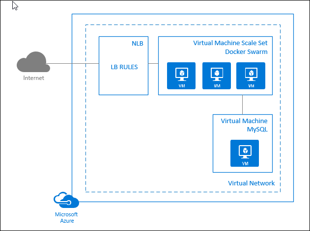

# Docker Swarm Mode running Azure Vote app as a service

This example completes the following:

- Deploys a VM, installs MySQL and prepares the Azure vote app back-end.
- Deploys a fully configured Docker Swarm (swarm mode)
- Creates a Docker service with a sample Flask app that stores and retrieves data from the MySQL instance.
- SSH keys are created if necessary and used when creating the Swarm and VM.
- An active directory service principal is created and configured with the Swarm. The AD SP is used to created NLB rules as services are exposed to the internet.

# Architecture



- As Docker services are started, a load balancing rule is created for inbound connectivity.
- An NSG is placed on the subnet of the MySQL VM. Only traffic on port 3306 is allowed to the MySQL subnet, and only from the Swarm subnet.

## Deploy example

Run the following command to deploy this example. Note, the system on which this is run will require the Docker client.

```
curl https://raw.githubusercontent.com/neilpeterson/flask-voting-app/master/deployment/azure-docker-swarm/azure-vote-docker-service.sh | bash
```
