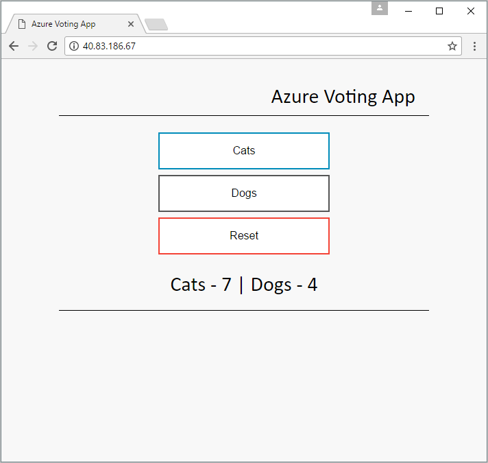

# Demo Azure voting app

Simple Flask app for demonstrating Azure IaaS architectural configurations. The voting app consists of a Flask app and a MySQL database.



## Configuration

The `config_file.cfg` can be found at the root of the repo. This file is used to configure the MySQL connection string and basic UI settings.

Sample File:

```
# MySql Configuration
MYSQL_DATABASE_USER = 'dbuser'
MYSQL_DATABASE_PASSWORD = 'Password12'
MYSQL_DATABASE_DB = 'azurevote'
MYSQL_DATABASE_HOST = '10.0.0.5'

# UI Configurations
TITLE = 'Azure Voting App'
VOTE1VALUE = 'Cats'
VOTE2VALUE = 'Dogs'
SHOWHOST = 'false'
```

UI Configuration:

| Configuration | Description |
|----|----|
| TITLE | Title to be displayed in app and on title bar. |
| VOTE1VALUE | This value will display as the first voting option. |
| VOTE2VALUE| This value will display as the second voting option. |
| SHOWHOST | If set to true, the title will be replaced with the name of the system or container hosting the application.  |


## Samples Deployment

Prerequisites:

- Azure CLI 2.0 installed and `az login` has been run.
- For any samples that include Docker, the Docker client is required.

**Virtual Machines** - [more information](./deployment/azure-vm).

```
curl https://raw.githubusercontent.com/neilpeterson/flask-voting-app/master/deployment/azure-vm/azure-vote-vm.sh | bash
```

**Virtual Machine Scale Set** - [more information](./deployment/azure-vmss).

```
curl https://raw.githubusercontent.com/neilpeterson/flask-voting-app/master/deployment/azure-vm/azure-vote-vm.sh | bash
```

**Docker Swarm Mode** - [more information](./deployment/azure-docker-swarm).

```
curl https://raw.githubusercontent.com/neilpeterson/flask-voting-app/master/deployment/azure-docker-swarm/azure-vote-docker-service.sh | bash
```